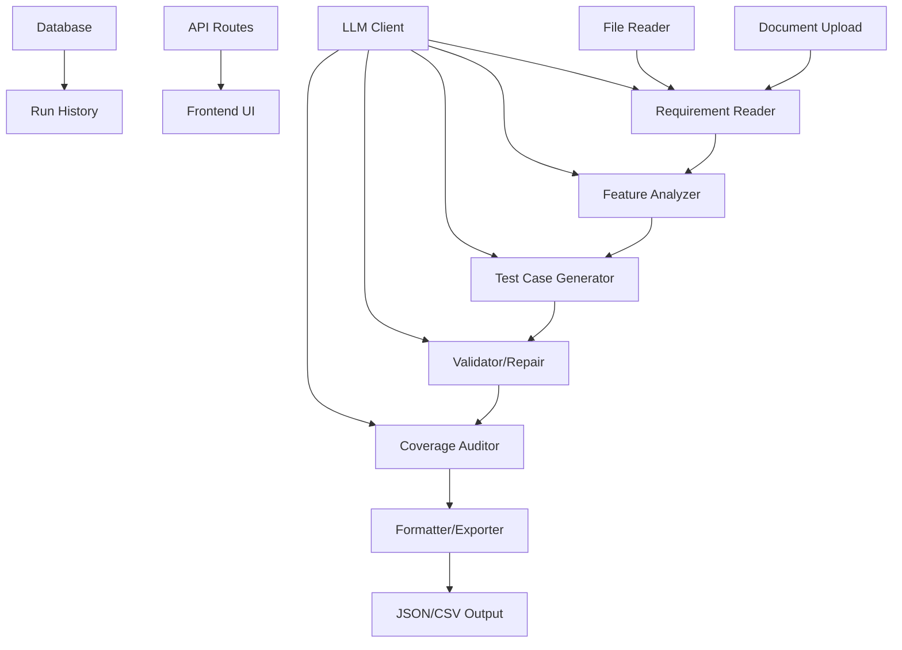
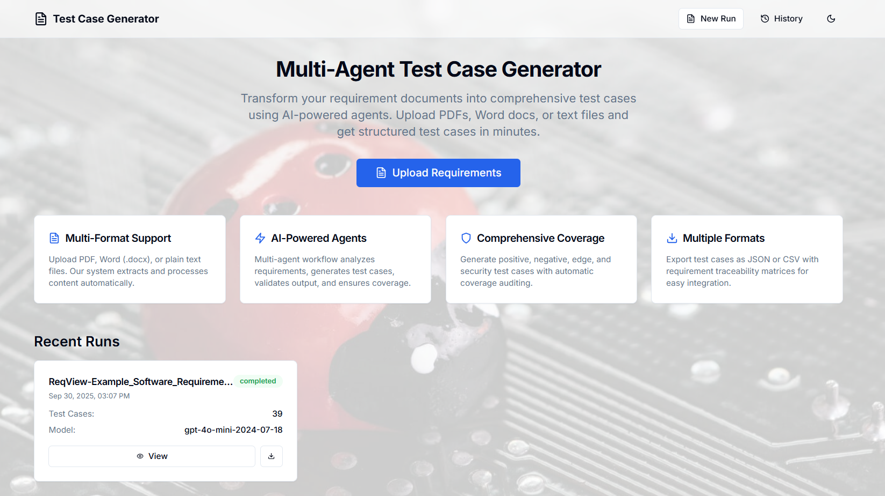
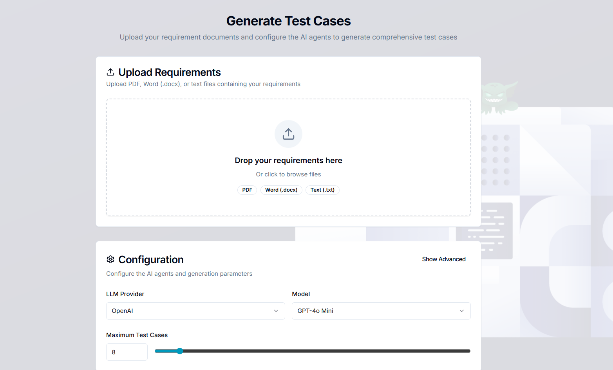
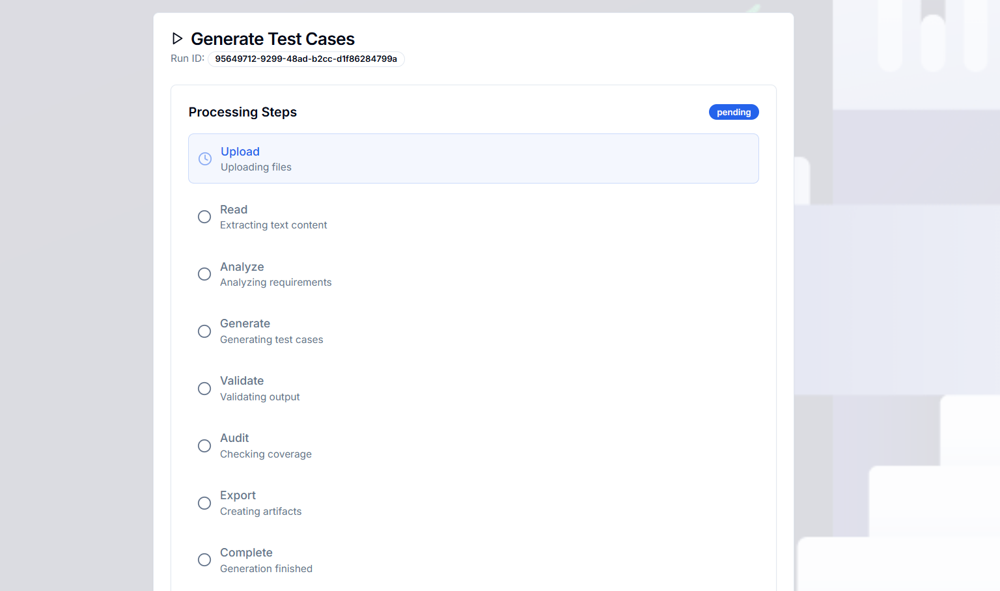
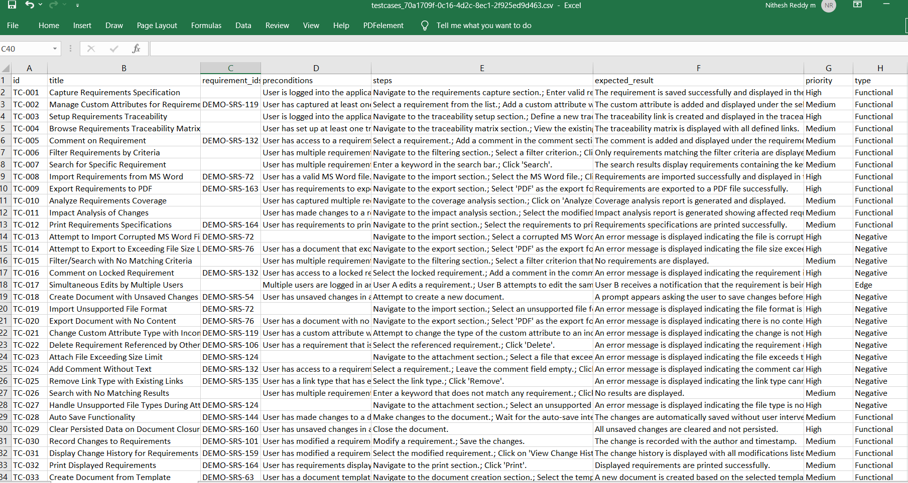

# Test Case Generator

> **Transform your requirement documents into comprehensive test cases using AI-powered agents**

A production-ready system that automatically generates structured test cases from requirement documents (PDF, Word, plain text) using a sophisticated multi-agent workflow.


## Key Features

- **Multi-Agent AI Workflow**: 6 specialized agents work together to analyze, generate, validate, and export test cases
- **Multi-Format Support**: Handles PDF, Word (.docx), and plain text files seamlessly
- **Comprehensive Test Coverage**: Generates positive, negative, edge case, and security test scenarios
- **Multiple Export Formats**: JSON and CSV outputs with traceability matrices
- **Real-time Progress**: Live status updates and progress tracking

##  Architecture



### Multi-Agent Workflow

1. ** Requirement Reader**: Extracts and chunks document content
2. ** Feature Analyzer**: Identifies features and requirements
3. **⚡ Test Case Generator**: Creates comprehensive test scenarios
4. **✅ Validator/Repair**: Ensures quality and fixes issues
5. ** Coverage Auditor**: Analyzes test coverage completeness
6. ** Formatter/Exporter**: Formats and exports results

##  Quick Start

### Prerequisites

- Python 3.8+
- Node.js 18+
- OpenAI API key

### Installation

1. **Clone the repository**
   ```bash
   git clone https://github.com/Nryreddy/TestAssist.git
   cd TestAssist
   ```

2. **Backend Setup**
   ```bash
   cd backend
   python -m venv venv
   source venv/bin/activate  # On Windows: venv\Scripts\activate
   pip install -r requirements.txt
   cp env.example .env
   # Edit .env with your OpenAI API key
   ```

3. **Frontend Setup**
   ```bash
   cd frontend
   npm install
   cp env.local.example .env.local
   ```

4. **Run the Application**
   ```bash
   # Terminal 1 - Backend
   cd backend && python main.py
   
   # Terminal 2 - Frontend
   cd frontend && npm run dev
   ```

5. **Access the Application**
   - Frontend: http://localhost:3000
   - Backend API: http://localhost:8001

##  Usage

1. **Upload Documents**: Drag and drop PDF, Word, or text files
2. **Configure Settings**: Choose LLM model, test case count, and options
3. **Generate**: Watch the multi-agent workflow process your documents
4. **Download**: Export results as JSON or CSV

### Screenshots

#### Home Page


#### Document Upload


#### Test Case Generation Flow


#### Output Results


## Configuration

### Environment Variables

**Backend (.env)**
```env
OPENAI_API_KEY=your_openai_api_key_here
DEFAULT_MODEL=gpt-4o-mini-2024-07-18
MAX_TOKENS=4000
TEMPERATURE=0.1
```

**Frontend (.env.local)**
```env
NEXT_PUBLIC_API_URL=http://localhost:8001
```

### Manual Deployment

1. **Backend**: Deploy FastAPI app to your preferred hosting service
2. **Frontend**: Build and deploy Next.js app to Vercel/Netlify
3. **Database**: Set up PostgreSQL for production


## 📝 License

This project is licensed under the MIT License - see the [LICENSE](LICENSE) file for details.

